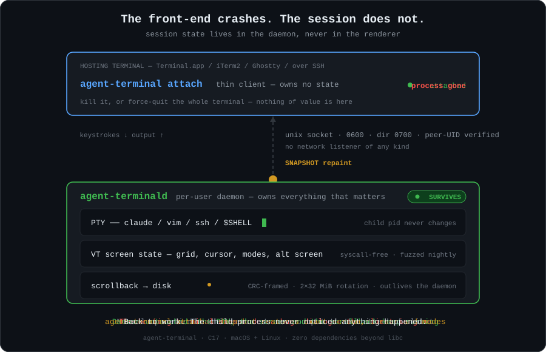

# agent-terminal

**English** | [繁體中文](README.zh-TW.md)

A tiny tmux-like session multiplexer in C, purpose-built so long-running
terminal AI agents (e.g. Claude Code CLI) survive terminal front-end
crashes. macOS + Linux. Zero dependencies beyond libc. MIT licensed.

> **Using a coding agent?** Point it at [AGENTS.md](AGENTS.md) — the same
> material as this README, written for machine consumption: exact commands,
> measured exit codes, invariants, and the non-interactive usage caveat that
> trips up scripted callers.

## Why

Session state (PTY, screen, scrollback) normally lives in the same process
that renders it. When a terminal emulator dies under a huge dialog — a
common failure mode for hours-long AI agent sessions — the session dies
with it. agent-terminal splits the two:

- **`agent-terminald`** — a per-user daemon that owns PTYs, the emulated
  screen state, and disk-persisted scrollback. It never dies with the
  front-end, and `reload` re-execs it in place under live sessions — a
  binary upgrade with every child process kept alive.
- **`agent-terminal`** — a thin client that runs inside any terminal
  (Terminal.app, iTerm2, Ghostty, over SSH), attaches via a unix socket,
  and renders. Kill the client — or force-quit the whole hosting
  terminal — then reattach: exact screen, cursor, and terminal modes
  restored; the child process never noticed. Panes, scrollback paging,
  and multi-client attach ride the same socket.

<p align="center">
  
</p>

<sub>The diagram animates in browsers that render SVG (GitHub does). Four
phases: normal operation → the hosting terminal dies → the daemon carries on
with the child still running → a new client attaches and a snapshot restores
the exact screen, cursor and modes.</sub>

## Installation

### From source

Requirements: a C17 compiler (clang or gcc) and make. Nothing else.

```sh
git clone https://github.com/timwukp/agent-terminal.git
cd agent-terminal
make                   # release build → build/release/
make test BUILD=asan   # optional: run unit tests under ASan/UBSan
sudo make install      # installs to /usr/local (override with PREFIX=)
```

Installed artifacts: `agent-terminald`, `agent-terminal`, and the
`agent-terminal(1)` man page.

### Run the daemon as a service (recommended)

The daemon auto-starts on first use, but a service manager restarts it
after crashes and reboots so `attach` always works:

**macOS (launchd):**
```sh
cp contrib/launchd/dev.agentterminal.daemon.plist ~/Library/LaunchAgents/
launchctl load ~/Library/LaunchAgents/dev.agentterminal.daemon.plist
```

**Linux (systemd user unit):**
```sh
mkdir -p ~/.config/systemd/user
cp contrib/systemd/agent-terminald.service ~/.config/systemd/user/
systemctl --user enable --now agent-terminald
loginctl enable-linger $USER   # keep sessions alive after logout
```

## Usage

### Quick start

```sh
agent-terminal new -s work -- claude    # run claude in a managed session
```

Work normally. If the terminal crashes, open a new one and:

```sh
agent-terminal attach -s work           # everything is still there
```

### Commands

| Command | Effect |
|---|---|
| `agent-terminal new [-s name] [-- cmd args...]` | Create a session and attach. Default name `main`, default command `$SHELL`. |
| `agent-terminal attach -s name` | Attach to a running session. |
| `agent-terminal ls` | List sessions (size, pid, attached clients). |
| `agent-terminal history -s name` | Dump scrollback to stdout. Works with **no daemon running** and for dead sessions. Pipe through `less -R`. |
| `agent-terminal kill -s name` | Terminate a session. |
| `agent-terminal reload` | Re-exec the daemon in place to pick up a new binary. Sessions, screens and scrollback survive; the pid does not change. Attached clients reconnect themselves. |
| `agent-terminal version` | Client build (git hash) plus the running daemon's pid, restart generation, and whether it supports panes. Works with no daemon (`daemon: not running`). |

A session name becomes a directory under `~/.agent-terminal/sessions/`, so it
must be a single path component: no `/`, no leading `.`, max 63 bytes. Interior
dots (`build_2026.08`) and non-ASCII (`日本語`) are fine. Invalid names exit 1.

### Panes

`Ctrl-\ "` and `Ctrl-\ %` split the active pane (top/bottom and side by
side); each pane is its own child process with its own screen and its own
scrollback history. The daemon composites the panes and draws the dividers,
so reattach after a crash restores the whole split exactly, and even an
older client renders a split session correctly — composited frames ride the
ordinary output path. Input, mouse reporting and bracketed paste follow the
**active** pane.

### Key bindings

- **`Ctrl-\` then `Ctrl-d`** — detach, leaving the session running.
  A lone `Ctrl-\` is forwarded to the application after 500 ms, so the
  chord does not steal the key.
- **`Ctrl-\` then `[`** — enter copy-mode to page through scrollback
  without detaching. The session keeps running; output produced while
  paging is skipped, and exiting repaints from a fresh daemon snapshot.
  With panes, copy-mode shows the **active** pane's history.
- **`Ctrl-\` then `"`** — split the active pane top/bottom.
- **`Ctrl-\` then `%`** — split the active pane side by side.
- **`Ctrl-\` then `o`** — focus the next pane; **`;`** the previous one
  (most recently active); **`x`** close the active pane. Closing the last
  pane ends the session. A split is refused (with an error) when the pane
  is smaller than 2×20 columns / 2×3 rows plus a divider.
- **`Ctrl-\` then an arrow key** — focus the nearest pane in that
  direction (straight across beats diagonal). A direction with no pane
  there does nothing.
- **`Ctrl-\` then `z`** — zoom: the active pane temporarily takes the
  whole view; `z` again (or any split/close/focus change) restores the
  layout. `ls` marks zoomed sessions.

Inside copy-mode:

| Key | Action |
| --- | ------ |
| `j` / `k`, `↓` / `↑` | one line |
| `Space` / `Ctrl-f`, `Ctrl-b`, `PgDn` / `PgUp` | one page |
| `Ctrl-d` / `Ctrl-u` | half a page |
| `g` / `G`, `Home` / `End` | oldest / newest line |
| `/`*pattern*, then `n` / `N` | search forward / backward (no wraparound) |
| `q` / `Esc` | leave copy-mode |

Copy-mode shows what has **scrolled off** the screen, so a session that
has printed 200 lines into a 24-row terminal offers 177 lines of history —
the other 23 are still on screen. Search matches the text you see, not the
colour escapes around it. The bottom row reports position and total.

### Scripted / non-interactive use

`agent-terminal new -s x -- cmd < /dev/null` creates the session and exits 0
once the daemon confirms it; the session persists with zero clients, ready
for `attach`. The client only reports what the daemon confirmed: pointing
`attach` at a session that does not exist fails with `no such session` and
rc=1 even with stdin at EOF, and a daemon that confirms nothing within 5 s
fails the command rather than hanging the script. To *drive* a session from
a script (type into it, watch output), hold stdin open — see
[AGENTS.md §4](AGENTS.md#4-scripted--non-interactive-use) for the FIFO
pattern.

### SSH sessions

```sh
agent-terminal new -s prod -- ssh user@host
```

This runs your **system OpenSSH client** inside the session — it inherits
`~/.ssh/config`, known_hosts, and your SSH agent. agent-terminal contains
no SSH or cryptographic code of its own.

### Typical workflows

```sh
# A long AI-agent session that must survive anything:
agent-terminal new -s agent -- claude

# Recover history after a crash (even of the daemon itself):
agent-terminal history -s agent | less -R

# Several parallel sessions:
agent-terminal new -s build -- make -j8
agent-terminal new -s logs  -- tail -f /var/log/system.log
agent-terminal ls

# Or split one session instead: agent in the left pane,
# Ctrl-\ % then tail the log on the right.
agent-terminal new -s work -- claude
```

## GUI client (`app/`, early preview)

A desktop client lives in [`app/tauri`](app/tauri) — Tauri + xterm.js over the
same Unix socket, no network listener added. It is **not** part of the
`make install` flow and has no release build yet; treat it as a preview you
build yourself.

```sh
cd app/tauri
npm ci && npm run build          # Tauri embeds dist/ at compile time
cd src-tauri && cargo build      # ./target/debug/agent-terminal-gui
```

That order is not a suggestion, and `cargo build` now enforces it: because the
frontend bundle is embedded at compile time, building only the Rust half ships
old JavaScript against new commands — which looks like a broken app rather than
a broken build (it rejected every keystroke once). The build script fails with
the fix instructions if `dist/` is missing or older than `src/`.

One consequence of embedding the frontend is that the app's **Content Security
Policy is functional configuration, not hardening decoration**. Tauri's IPC on
macOS is a `fetch` to `ipc://localhost/<command>` while the page itself is served
from `tauri://localhost` — a different scheme — so a policy without `ipc:` in
`connect-src` blocks it. Tauri then falls back to `postMessage`, which
JSON-encodes its payload and therefore *cannot* carry raw bytes. The only
command that sends raw bytes is terminal input, so the visible symptom is
oddly specific: rendering, the sidebar and session switching all work, and the
keyboard is dead. A unit test asserts the shipped policy keeps that scheme.

What works today: a sidebar listing live sessions with pane count, zoom badge
and client count (the same data as `ls`, polled); click to attach and render;
one-click templates for a new Claude or shell session; kill a session; keyboard
input; click-to-focus inside splits.

Two properties are worth stating because they are easy to assume wrong:

- **It coexists with the CLI.** Multi-client attach is native to the daemon, so
  `agent-terminal attach -s work` in a terminal and the GUI showing `work` both
  render the same session live; neither steals the other's input.
- **It is a viewer: it never resizes your session.** Session geometry is durable
  session state shared by every client, so a window that imposed its own size
  would reflow a running TUI under whoever else is attached. The GUI attaches
  with a "keep your current size" sentinel and scales its view to the window
  instead (letter-boxed, never past 1:1). Resizing the window changes nothing
  on the far end.

Not implemented yet: drag-to-resize panes (needs a new protocol message), and
the token-usage, hooks and security panels — those crates are stubs today.
Acceptance is a manual checklist in [docs/UAT.md](docs/UAT.md#gui-client-apptauri--manual-checklist);
wire-level behaviour is covered by real-daemon integration tests under
`app/tauri/src-tauri/crates/at-client/tests/`.

## Scrollback persistence

Lines scrolling off the primary screen are kept in a 10k-line in-memory
ring and appended to a CRC-framed on-disk log
(`~/.agent-terminal/sessions/<name>/scrollback.log`, 2×32 MiB rotation).
The log survives daemon crashes — recovery truncates at the first torn
record — and `history` reads it directly, no daemon required. Records
store rendered ANSI text, so even a raw `less -R scrollback.log` is
legible.

When a session ends, the still-visible screen is flushed to the log as
well, so a short crash message that never scrolled off is still
recoverable with `history`. Sessions ending on the alternate screen
(vim, htop) are not flushed — the log holds primary-screen content only.

## Security

See [SECURITY.md](SECURITY.md) for the threat model and how to report
vulnerabilities. Highlights:

- Unix socket in a 0700 dir, 0600 socket, peer-UID verified
  (`SO_PEERCRED` / `getpeereid`). No network listener of any kind.
- The VT parser — the untrusted-input surface — is an isolated,
  **syscall-free** library (`src/vt/`), fuzzed nightly (libFuzzer) and run
  under ASan+UBSan on every PR, with golden-replay conformance tests
  against real vttest captures.
- No crypto code in this repo: SSH is delegated to the system OpenSSH
  binary.

## Limitations

The original v1 release documented four deliberate gaps — no scrollback
paging, dropped combining marks, children dying on daemon restart, and no
panes. All four are implemented. What remains:

- No windows/tabs — one session is one visible surface. Splits stop at
  6 panes per session, and a pane below 20×3 plus a divider refuses to
  split further.
- A daemon **crash** still kills child processes. A daemon **restart** no
  longer does: `agent-terminal reload` (or `SIGHUP`) re-execs the daemon in
  place, so the pid never changes, no PTY master fd is ever closed, no child
  sees a carrier-loss `SIGHUP`, and the daemon is still each child's parent
  afterwards. Screens and scrollback carry across; attached clients
  reconnect on their own. That is what upgrading the binary under a live
  session needs, and it is tested (`tests/integration/test_restart.sh`).

  Crash survival is a different problem and is **not** solved. On `SIGSEGV`
  or `kill -9` no code of ours runs, so nothing can hold the master fds open
  — and it is the fd closing, not the daemon exiting, that hangs up the
  children. Fixing that means a second process that is both the fd holder
  and the child's parent, i.e. inverting the architecture so a supervisor
  spawns PTYs and the daemon becomes a stateless renderer. Deliberately out
  of scope. Scrollback still survives on disk and `history` recovers it.

  Note for `systemd` users: `systemctl --user restart` does **not** preserve
  sessions — stopping the daemon closes its fds. Use `reload`. The shipped
  unit also sets `KillMode=mixed`, without which `stop` would `SIGTERM`
  every process in the cgroup, children included, no matter what the daemon
  does; `setsid` does not leave a cgroup.
- **One** combining mark per cell, and only from the BMP (U+0000–U+FFFF).
  That covers every modern living script; a cluster with two or more marks
  keeps the first, and marks in the supplementary planes (archaic scripts,
  musical notation) are still dropped. ZWJ sequences are not clusters here,
  so a multi-person emoji splits into its component glyphs. CJK wide
  characters are fully supported.

## Troubleshooting

**Is the daemon running, and which build?**
```sh
agent-terminal version
# agent-terminal 1a2b3c4d5e6f
# daemon: pid 4242, generation 3, panes yes
```
`generation` counts in-place reloads (the pid deliberately does not change
across one). `daemon: not running` is not an error — the next `new` or
`attach` autospawns it.

**`new -s x -- some-cmd` "does nothing" — session missing from `ls`?** The
command exited instantly, usually because it is **not on the daemon's
PATH**: a service-managed daemon gets a minimal PATH (launchd:
`/usr/bin:/bin:...`), and session commands inherit it. The failure is
named on the session's screen and preserved in scrollback:
```sh
agent-terminal history -s x
# agent-terminald: exec some-cmd: No such file or directory
# (daemon PATH: /usr/bin:/bin:/usr/sbin:/sbin)
```
Fix: add the command's directory to the service unit's PATH — see the
`EnvironmentVariables` block in the shipped launchd plist, or the
commented `Environment=PATH=` line in the systemd unit — then reload the
service. An absolute path (`-- /full/path/to/cmd`) also works.

**Key chords do nothing (splits, copy-mode)?** Almost always a version skew:
an older daemon is answering the socket. Unknown messages are skipped by
design, so new chords no-op silently against an old daemon. `agent-terminal
version` shows the mismatch (`panes no`, or a daemon hash older than the
client's), and the client warns on attach. Fix without losing sessions:
```sh
agent-terminal reload
```

**Client crashed / terminal froze?** The session is fine. Open a new
terminal and `agent-terminal attach -s <name>`. If you don't remember the
name: `agent-terminal ls`.

**Daemon actually crashed?** Sessions and their children are gone (see
Limitations), but scrollback survives on disk:
```sh
agent-terminal history -s <name> | less -R
```
The next `new` starts a fresh daemon; a leftover socket or lock file from
the crash is detected and cleaned up automatically.

**A session vanished from `ls`?** Its child exited — that is `ls`'s
contract (finished sessions disappear rather than showing "dead"). The final
screen was flushed to scrollback, so `history -s <name>` shows what it
printed last, including output that never scrolled off.

**Scripted call hangs or lies?** It shouldn't: with stdin at EOF the client
waits for the daemon's confirmation, fails `no such session` for missing
sessions (rc=1), and gives up with `no confirmation from daemon` after 5 s
against a wedged daemon. See
[AGENTS.md §4](AGENTS.md#4-scripted--non-interactive-use).

## Testing

Three layers, all green on `main`:

- **Unit**: 6,340 checks across 9 suites (VT parser byte-at-a-time, protocol
  round-trips and violations, ring, scrollback CRC recovery, pane layout
  geometry, input-chord scanner, pager, path validation, event loop) — run
  under ASan+UBSan.
- **Integration**: 22 end-to-end scripts covering the failure modes this tool
  exists for — client `kill -9` + reattach, daemon reload with children
  surviving, pane splits / directional navigation / zoom driven over the
  wire, a 100 MB memory-bound soak, malformed handoff state files,
  path-traversal probes, close races, honest error reporting. Run on macOS
  and Linux in CI on every PR.
- **End-user UAT with a real Claude Code session** — the actual workload,
  driven through a real pty with real keystrokes, two full rounds (27
  cases): crash-reattach with the same process answering, panes with arrow
  navigation and zoom around a live TUI, a daemon binary upgrade under the
  conversation, multi-client viewing, batch `claude -p` patterns. Full test
  logs — case IDs, data, procedure, verdicts, the macOS reload bug round 1
  caught, and the TUI testing playbook — in **[docs/UAT.md](docs/UAT.md)**.

## Development

```sh
make BUILD=debug            # -O0 -g3
make test BUILD=asan        # unit tests under ASan+UBSan
make fuzz-regress BUILD=asan  # replay fuzz corpus (works with any compiler)
make fuzz BUILD=fuzz CC=clang # libFuzzer binaries (needs fuzzer runtime)
BUILD=release bash tests/integration/test_reattach.sh   # acceptance test
python3 tools/check_svg.py docs/architecture.svg        # diagram geometry
```

`BUILD` must match between building and testing — the integration scripts
resolve `build/$BUILD` and say so explicitly if the binaries are absent.

Layout: `src/vt/` (isolated VT engine), `src/daemon/`, `src/client/`,
`src/common/` (protocol, ring, scrollback), `tests/`, `fuzz/`.

Contributor guide: [CONTRIBUTING.md](CONTRIBUTING.md). Machine-oriented
reference for coding agents: [AGENTS.md](AGENTS.md).

## License

[MIT](LICENSE). Provided **"as is"**, without warranty of any kind — see
the LICENSE file for the full disclaimer of warranties and liability.
